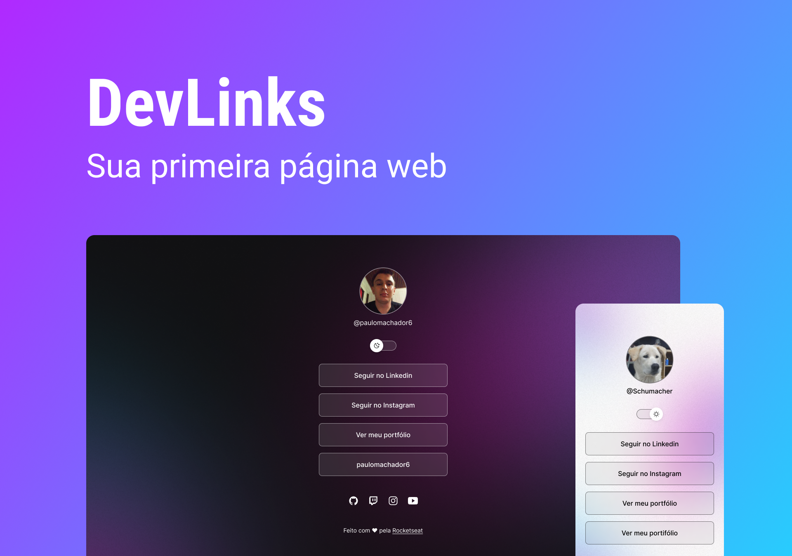

<h1 align="center">DevLinks <h1>

Formação exclusiva e gratuita. ofertada pela Rocketseat para ensino de tecnologia 
WEB.

 
<a href="#ancora">Tecnologias</a>
<a href="#projeto">Projeto</a>
<a href="#layout">Layout</a>
<a href="#licenca">Licença</a>

 

 

## 
🚀 Tecnologias

 
Esse projeto foi desenvolvido com as seguintes tecnologias:

- HTML e CSS
- JavaScript
- Git e GitHub
- Figma
     

## 
 💻 Projeto

O Devlinks é um agregador de links para usar como cartão de visitas online.

 

##  
📋 Layout 

Você pode visualizar o layout do projeto através [DESSE LINK]
(https://www.figma.com/community/file/1187422022288947321). É necessário ter conta no[Figma] (https://figma.com) para acessá-lo.

  

## 
📝 Licença

 

Esse projeto está sob a Licença MIT.

Feito com ❤ by Rocketseat :wave: [Participe da nossa comunidade!]
(https://discord.gg/rocketseat)

inscreva-se no devLinks através (https://www.rocketseat.com.br/)
